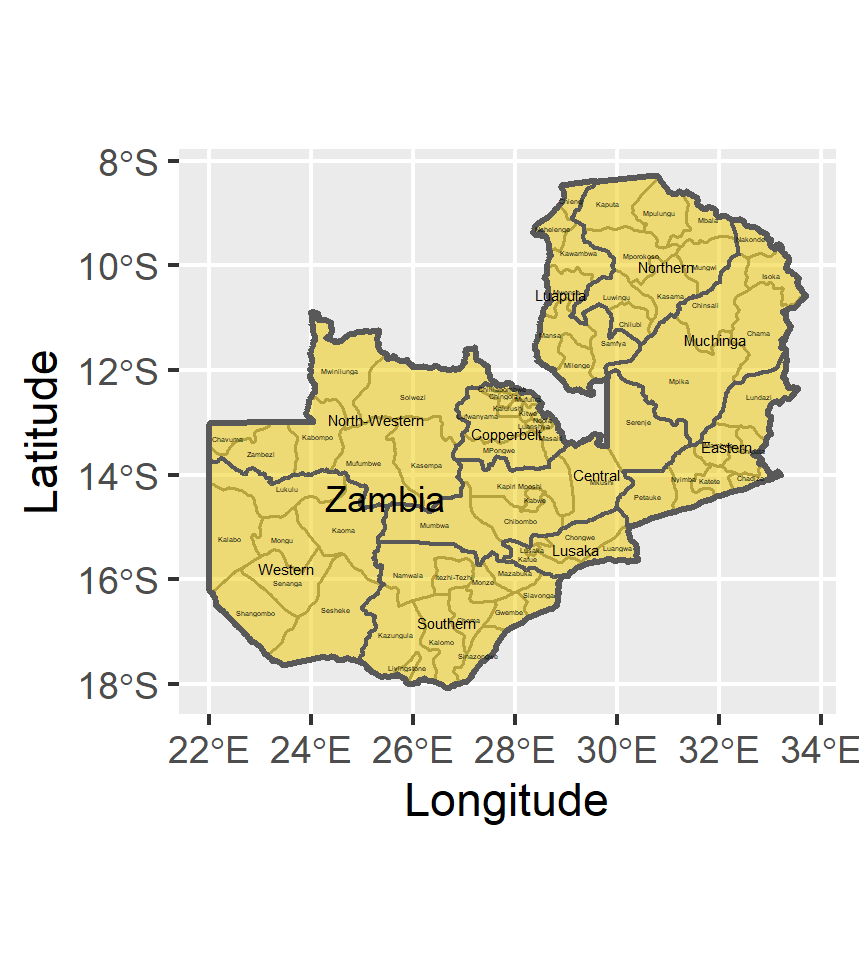
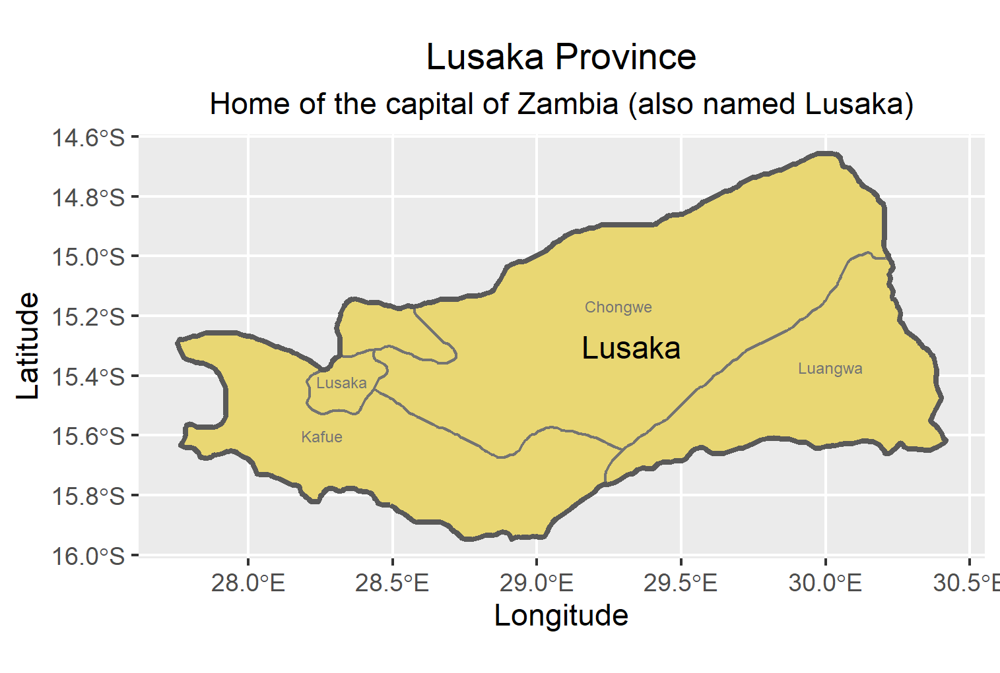

# Project 1 - Plotting and Labelling Administrative Subdivisions

### Challenge: 
#### Using the ggplot command, I was able to plot and label the administrative subdivisions of Zambia.

### Stretch Goal 2:
#### Subsequently, I plotted a province of Zambia. Not just any province, however. The capital lies within this province and in fact shares the same name.

