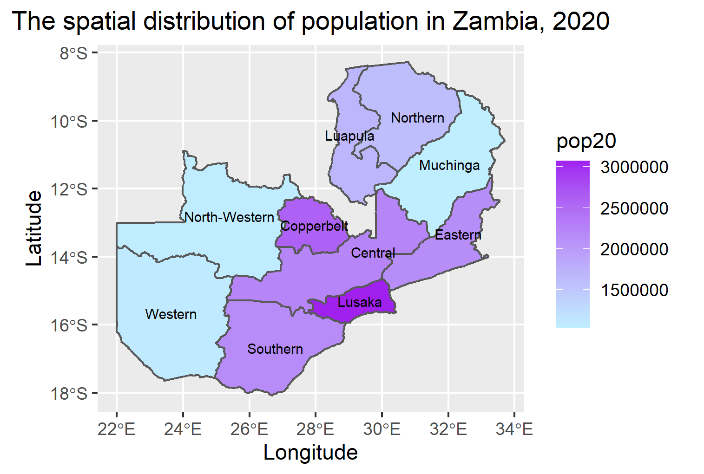
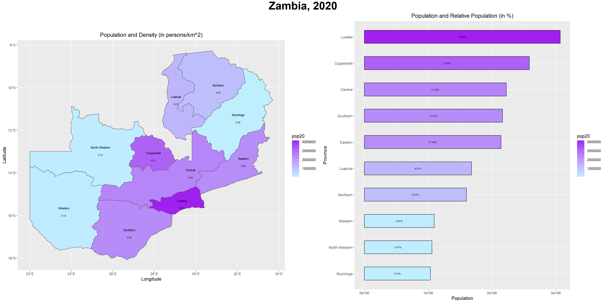

# Project 2
### Challenge:
#### I extracted Zambia's 2020 population counts from a raster and plotted the spatial distribution below:

### Deliverable:
#### I produced a figure consisting of a spatial plot and a bar plot. The spatial plot displays the population density of each of Zambia's provinces in 2020. The bar plot gives the relative population among the provinces.

